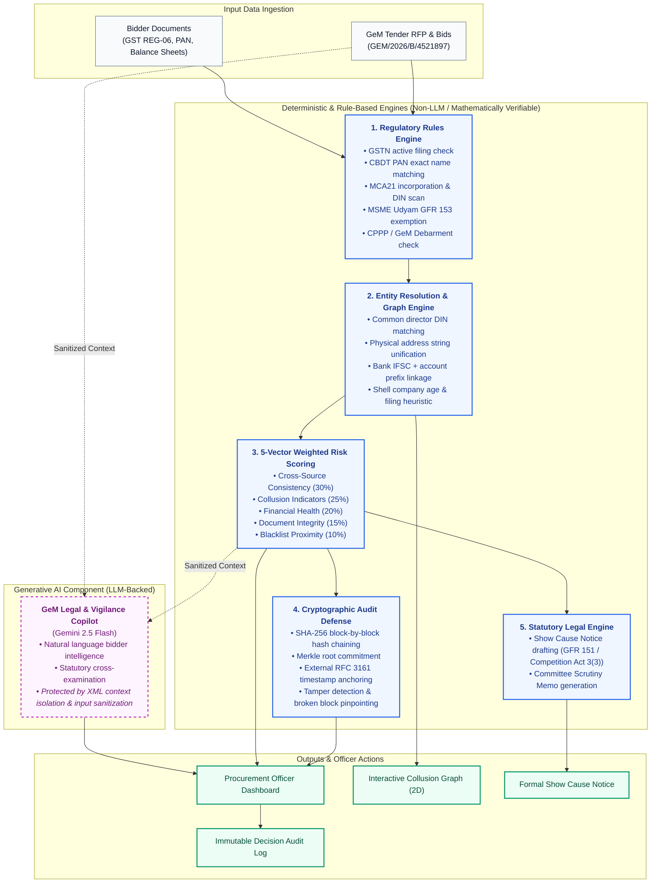

# 🛡️ AuthBid — GeM Compliance Intelligence

> **AI-Powered Integrated Bid Compliance Verification & Collusion Detection Platform for GeM Procurement**  
> *Smart India Hackathon (SIH26100)*

---

## 📖 Quick Links
- **[Full Project Functionalities & Architecture (FEATURES.md)](file:///c:/Users/ASUS/Downloads/sih%202/FEATURES.md)**
- **Frontend URL:** [http://localhost:3000](http://localhost:3000)
- **Backend API:** [http://localhost:8000](http://localhost:8000)
- **Interactive API Docs (Swagger):** [http://localhost:8000/docs](http://localhost:8000/docs)

---

## ⚡ Quick Start (Local Run)

### 1. Start Backend
```powershell
cd backend
python -m uvicorn main:app --host 127.0.0.1 --port 8000 --reload
```

### 2. Start Frontend
```powershell
cd frontend
npm run dev
```

### 3. Or Run via Docker Compose
```bash
docker compose up -d
```

---

## 🏗️ System Architecture: Deterministic Rules vs. LLM Copilot



---

## 🌟 Core Technical Differentiators
* **Deterministic Rule Scrutiny**: Hard eligibility checks and risk scores are computed mathematically, NOT hallucinated by an LLM.
* **OSINT Graph Entity Resolution**: Detects cartel syndicates (Ring 1 & Ring 2) across shared directors, physical addresses, and banking channels.
* **Explainable 5-Component Risk Formula**: Full transparency into Consistency (30%), Collusion (25%), Financials (20%), Documents (15%), and Debarment (10%).
* **Cryptographic Tamper-Evident SHA-256 Audit Chain**: Complete mathematical ledger with external RFC 3161 Merkle anchoring.
* **Role-Based Access Control (RBAC)**: Distinct permissions for Officers, Committee Members, and System Admins.
* **Prompt-Injection Defense**: Strictly sanitizes and isolates bidder document text in Copilot prompts.
* **Document Vault with Inline Preview**: Checksum-verified certificate preview without mandatory downloads.
* **Decision Safeguards**: Mandatory justification modals and visible audit logs for disqualifications.

For comprehensive architectural details and regulatory roadmaps, please refer to [FEATURES.md](file:///c:/Users/ASUS/Downloads/sih%202/FEATURES.md), [docs/REGULATORY_INTEGRATION_ROADMAP.md](file:///c:/Users/ASUS/Downloads/sih%202/docs/REGULATORY_INTEGRATION_ROADMAP.md), and [docs/AUDIT_ANCHORING.md](file:///c:/Users/ASUS/Downloads/sih%202/docs/AUDIT_ANCHORING.md).

